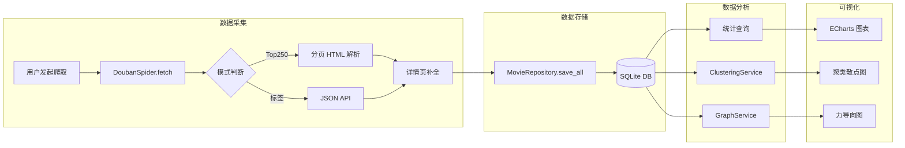

# 🎬 豆瓣电影爬虫项目结构分析报告

> **分析时间**: 2025-12-21  
> **分析目标**: 评估项目是否符合大作业要求，识别亮点与改进空间  
> **声明**: 本报告仅作为项目分析文档，不涉及任何代码修改

---

## 一、项目概览

### 1.1 项目简介

本项目是一个基于 **Python Flask** 框架的豆瓣电影数据爬取与可视化分析平台。项目实现了完整的数据工程流程：

```
数据爬取 → 持久化存储 → 数据分析 → 可视化展示
```

### 1.2 核心指标

| 指标 | 数值 | 说明 |
|:---|:---:|:---|
| **总代码行数** | ~1,400 行 | 不含空行和注释 |
| **Python 模块** | 6 个 | spider, storage, analysis 等 |
| **HTML 模板** | 14 个 | 完整的 Web 界面 |
| **数据库表** | 11 个字段 | 电影元数据完整 |
| **外部依赖** | 28 个 | 见 `requirements.txt` |

### 1.3 项目目录结构

```
douban-flask/
├── app.py                   # Flask Web 应用入口 (439 行)
├── main.py                  # CLI 命令行入口 (100 行)
├── requirements.txt         # Python 依赖清单
├── README.md               # 项目说明文档
│
├── spider/                  # 数据获取层
│   ├── __init__.py
│   └── douban_spider.py     # 爬虫核心实现 (271 行)
│
├── storage/                 # 数据持久化层
│   ├── __init__.py
│   └── repository.py        # DAO 数据访问对象 (230 行)
│
├── analysis/                # 数据分析层
│   ├── __init__.py
│   ├── clustering.py        # K-Means + t-SNE 聚类 (196 行)
│   └── graph.py             # 知识图谱构建 (100 行)
│
├── templates/               # 视图模板层 (Jinja2)
│   ├── base.html            # 基础模板 (290 行)
│   ├── index.html           # 首页看板
│   ├── movie.html           # 电影列表
│   ├── detail.html          # 电影详情 + 相似推荐
│   ├── analysis.html        # 数据分析大屏 (27,094 字节)
│   ├── admin.html           # 后台管理
│   └── ...                  # 其他页面
│
├── static/                  # 静态资源
│   └── assets/
│       ├── css/             # 样式表
│       ├── js/              # JavaScript (ECharts)
│       ├── img/             # 图片资源
│       └── vendor/          # 第三方库
│
├── data/                    # 数据存储
│   ├── movie.db             # SQLite 数据库 (~600KB)
│   └── status.json          # 爬虫状态文件
│
└── tests/                   # 测试目录 (空)
    └── __init__.py
```

---

## 二、大作业要求符合度评估

### 2.1 考察功能完成情况

| 考察要求 | 完成状态 | 实现方式 |
|:---|:---:|:---|
| **考察功能 1**: 爬取更多类型与数量 | ✅ **已完成** | 支持 Top250 + 自定义标签(如"喜剧"、"科幻")两种模式，可配置爬取数量 |
| **考察功能 2**: 电影类型、数量统计分析 | ✅ **已完成** | 实现了类型分布饼图、年份分布柱状图、国家/地区统计 |

#### 2.1.1 爬取功能详解

**支持的爬取模式**（见 [douban_spider.py:30-78](file:///wsl.localhost/Ubuntu/home/ayanamiset/code/douban/spider/douban_spider.py#L30-L78)）：

1. **Top 250 模式**：分页爬取豆瓣 Top 250 榜单（每页 25 部，共 10 页）
2. **标签模式**：通过豆瓣 JSON API 按标签爬取（如"动作"、"爱情"），可配置 `limit` 参数控制数量

```python
# 命令行示例
python main.py --type tag --tag 科幻 --limit 300
```

**爬取数据字段**（11 个完整字段）：

| 字段名 | 说明 | 来源 |
|:---|:---|:---|
| `info_link` | 电影详情页链接 | 列表页 |
| `pic_link` | 电影海报链接 | 列表页 |
| `cname` | 电影中文名 | 列表页 |
| `score` | 豆瓣评分 | 列表页 |
| `rated` | 评价人数 | 详情页 |
| `introduction` | 剧情简介 | 详情页 |
| `year_release` | 上映年份 | 详情页 |
| `country` | 制片国家/地区 | 详情页 |
| `category` | 电影类型 | 详情页 |
| `directors` | 导演 | 详情页 |
| `actors` | 主演（前5位） | 详情页 |

#### 2.1.2 数据分析功能详解

**已实现的统计分析**（见 [analysis.html](file:///wsl.localhost/Ubuntu/home/ayanamiset/code/douban/templates/analysis.html)）：

1. **类型分布分析**：饼图展示各类型电影占比
2. **年份分布分析**：柱状图展示不同年代的电影数量
3. **评分分布分析**：柱状图展示评分区间的电影数量
4. **国家/地区分析**：柱状图展示各国电影产量

---

### 2.2 额外功能完成情况

> **要求**: 每队需完成至少 2 项额外功能

| 额外功能 | 完成状态 | 实现亮点 |
|:---|:---:|:---|
| **功能 1**: 词云可视化 | ✅ **已完成** | 支持类型词云 + 简介词云两种模式，使用 jieba 分词 + TF-IDF 关键词提取 |
| **功能 2**: K-Means 聚类分析 | ✅ **已完成** | 基于 TF-IDF 特征 + t-SNE 降维，实现电影智能分类 |
| **功能 3**: 知识图谱 | ✅ **已完成** | 构建导演-演员关系网络，ECharts 力导向图展示 |
| **功能 4**: 相似电影推荐 | ✅ **已完成** | 基于余弦相似度的内容推荐算法 |
| **功能 5**: 数据导出 | ✅ **已完成** | 支持 Excel (.xlsx) 格式导出 |
| **功能 6**: 后台管理系统 | ✅ **已完成** | 可视化爬虫控制、进度监控、数据源切换 |

#### 2.2.1 亮点功能：智能聚类分析

**实现原理**（见 [clustering.py:41-136](file:///wsl.localhost/Ubuntu/home/ayanamiset/code/douban/analysis/clustering.py#L41-L136)）：

```
1. 特征工程
   └─ 混合语料构建：简介 + (类型×3) + (导演×5) + (系列名×10)
   └─ 停用词过滤：通用中文停用词 + 电影领域专用噪音词

2. 向量化
   └─ TF-IDF 向量化（N-gram 1-2）

3. 聚类
   └─ K-Means 算法（n_init=100 防止局部最优）

4. 降维可视化
   └─ t-SNE 非线性降维（perplexity=50, early_exaggeration=24）
```

#### 2.2.2 亮点功能：知识图谱

**实现原理**（见 [graph.py](file:///wsl.localhost/Ubuntu/home/ayanamiset/code/douban/analysis/graph.py)）：

```
1. 节点提取
   └─ 导演节点（标记为 category 0）
   └─ 演员节点（标记为 category 1）

2. 边构建
   └─ 导演-演员合作关系
   └─ 演员-演员共演关系（仅前3位主演）

3. 可视化
   └─ ECharts 力导向图
   └─ 节点大小 = 10 + 出现次数 × 3（封顶 60）
   └─ 边粗细 = 1 + 合作次数（封顶 8）
```

---

### 2.3 应用程序要求符合度

| 要求项 | 完成状态 | 评估说明 |
|:---|:---:|:---|
| **面向对象设计** | ✅ **完全符合** | 见下方详细分析 |
| **Python 语言** | ✅ **完全符合** | 100% Python 后端 |
| **多代码文件组织** | ✅ **完全符合** | 6+ 核心模块，分层清晰 |
| **用户操作提示** | ✅ **已实现** | Flash 消息、加载动画、进度条 |
| **程序健壮性** | ✅ **已实现** | try-except 异常处理、超时控制 |
| **界面美化** | ✅ **已实现** | Bootstrap 5 + 渐变色 + 响应式 |

#### 2.3.1 面向对象设计分析

项目采用了规范的 **OOP 设计模式**：

| 类名 | 文件位置 | 设计模式 | 职责 |
|:---|:---|:---:|:---|
| `DoubanSpider` | [spider/douban_spider.py](file:///wsl.localhost/Ubuntu/home/ayanamiset/code/douban/spider/douban_spider.py) | Strategy | 封装两种爬取策略 |
| `MovieRepository` | [storage/repository.py](file:///wsl.localhost/Ubuntu/home/ayanamiset/code/douban/storage/repository.py) | DAO | 数据访问抽象层 |
| `ClusteringService` | [analysis/clustering.py](file:///wsl.localhost/Ubuntu/home/ayanamiset/code/douban/analysis/clustering.py) | Service | 聚类业务逻辑 |
| `GraphService` | [analysis/graph.py](file:///wsl.localhost/Ubuntu/home/ayanamiset/code/douban/analysis/graph.py) | Service | 图谱构建逻辑 |

**类设计亮点**：

1. **封装性**：每个类只暴露必要的公共接口
2. **单一职责**：`DoubanSpider` 只负责爬取，不涉及存储
3. **依赖注入**：`ClusteringService` 接收 `MovieRepository` 实例
4. **类型提示**：全面使用 `typing` 模块进行类型注解

```python
# 示例：依赖注入设计
class ClusteringService:
    def __init__(self, repo: MovieRepository):
        self.repo = repo  # 依赖注入
```

---

## 三、项目架构分析

### 3.1 整体架构

项目采用经典的 **MVC 变体架构**：

```
┌─────────────────────────────────────────────────────────────┐
│                        表现层 (View)                         │
│  templates/*.html + static/assets (ECharts, Bootstrap)     │
└───────────────────────────┬─────────────────────────────────┘
                            │ Jinja2 渲染
┌───────────────────────────▼─────────────────────────────────┐
│                       控制层 (Controller)                    │
│                         app.py                              │
│        路由分发 + 认证装饰器 + API 接口                       │
└───────────────────────────┬─────────────────────────────────┘
                            │ 调用
┌───────────────────────────▼─────────────────────────────────┐
│                       业务逻辑层 (Service)                   │
│     analysis/clustering.py  +  analysis/graph.py           │
└───────────────────────────┬─────────────────────────────────┘
                            │ 依赖
┌───────────────────────────▼─────────────────────────────────┐
│                       数据访问层 (DAO)                       │
│                     storage/repository.py                   │
└───────────────────────────┬─────────────────────────────────┘
                            │ SQL
┌───────────────────────────▼─────────────────────────────────┐
│                      持久化层 (Database)                     │
│                       data/movie.db (SQLite)                │
└─────────────────────────────────────────────────────────────┘

外部数据源：spider/douban_spider.py ──→ 豆瓣网站
```

### 3.2 数据流分析



---

## 四、代码质量分析

### 4.1 优点

| 维度 | 评分 | 说明 |
|:---|:---:|:---|
| **模块化设计** | ⭐⭐⭐⭐⭐ | 分层清晰，职责明确 |
| **代码注释** | ⭐⭐⭐⭐ | 关键逻辑有详细中文注释 |
| **类型提示** | ⭐⭐⭐⭐ | 使用 `typing` 模块进行类型注解 |
| **异常处理** | ⭐⭐⭐⭐ | 爬虫模块有完善的 try-except |
| **代码风格** | ⭐⭐⭐⭐ | 命名规范，缩进一致 |

### 4.2 技术亮点

1. **增量保存策略**
   ```python
   # main.py 中的回调函数设计
   def _save_chunk(chunk):
       saved_count = repo.save_all(chunk)
   
   spider.fetch(progress_callback, save_callback=_save_chunk)
   ```
   - 爬取过程中实时保存，避免一次性内存爆炸
   - 即使中途失败也能保留已爬取数据

2. **反爬策略**
   - User-Agent 伪装为 Chrome 浏览器
   - 可配置延迟 (`delay` 参数)
   - 超时控制 (`timeout=5s`)

3. **特征工程创新**
   ```python
   # 混合权重策略
   full_text = " ".join(
       intro_words +           # 简介
       genre_words * 3 +       # 类型 ×3
       director_words * 5 +    # 导演 ×5
       series_words * 10       # 系列名 ×10
   )
   ```
   - 通过重复特征词提升重要特征的 TF-IDF 权重

4. **动态停用词表**
   ```python
   common_stops = set(['的', '了', '和', ...])
   domain_stops = set(['电影', '影片', '讲述', ...])
   ```
   - 通用停用词 + 电影领域专用停用词，提升分析质量

---

## 五、改进建议

> **声明**: 以下建议仅供参考，不涉及任何代码修改

### 5.1 测试覆盖 ⚠️

**当前状态**: `tests/` 目录为空

**建议**:
- 为 `DoubanSpider` 类添加单元测试（Mock 网络请求）
- 为 `MovieRepository` 添加数据库操作测试
- 为 `ClusteringService` 添加算法正确性测试

```python
# 示例：建议的测试结构
tests/
├── test_spider.py          # 爬虫模块测试
├── test_repository.py      # 数据库操作测试
├── test_clustering.py      # 聚类算法测试
└── test_app.py             # Flask 路由测试
```

### 5.2 安全性 ⚠️

**当前问题**:

1. **SQL 注入风险**（低风险）
   ```python
   # repository.py 中使用了 f-string 拼接表名
   sql = f"select * from {self.table_name}"
   ```
   - 虽然表名来自内部，但建议使用白名单验证

2. **硬编码密码**
   ```python
   # app.py:233
   if password == "douban666":
   ```
   - 建议使用环境变量或配置文件

3. **Session 安全**
   ```python
   # app.py:16
   app.secret_key = "douban_secret_key_123"
   ```
   - 建议使用随机生成的密钥

### 5.3 代码重复 ⚠️

**现象**: `app.py:205-211` 存在重复代码

```python
wb = openpyxl.Workbook()
ws = wb.active
ws.title = "豆瓣电影数据"

wb = openpyxl.Workbook()  # ← 重复创建
ws = wb.active
ws.title = "豆瓣电影数据"
```

**建议**: 删除重复的 3 行代码

### 5.4 依赖版本 ⚠️

**当前问题**: `requirements.txt` 中使用了 2020 年的旧版本

| 包名 | 当前版本 | 最新稳定版 |
|:---|:---|:---|
| Flask | 1.1.2 | 3.0+ |
| numpy | 1.19.0 | 1.26+ |
| Pillow | 7.2.0 | 10.0+ |

**建议**: 升级到较新版本以获得性能和安全改进

### 5.5 配置管理 💡

**当前问题**: 配置项分散在代码中

```python
# app.py
DB_PATH = os.path.join("data", "movie.db")

# douban_spider.py
"User-Agent": "Mozilla/5.0 ..."
```

**建议**: 创建 `config.py` 统一管理配置

### 5.6 日志系统 💡

**当前状态**: 使用 `print()` 输出日志

**建议**: 使用 Python `logging` 模块

```python
import logging
logging.basicConfig(level=logging.INFO)
logger = logging.getLogger(__name__)
logger.info("开始爬取...")
```

### 5.7 接口文档 💡

**建议**: 为 API 接口添加文档

| 接口 | 方法 | 说明 |
|:---|:---:|:---|
| `/api/crawl` | POST | 启动爬虫任务 |
| `/api/progress` | GET | 查询爬虫进度 |
| `/api/cluster/data` | GET | 获取聚类数据 |
| `/api/graph/data` | GET | 获取图谱数据 |

---

## 六、总结

### 6.1 项目整体评价

| 评价维度 | 评分 | 说明 |
|:---|:---:|:---|
| **功能完整性** | ⭐⭐⭐⭐⭐ | 远超基本要求，额外功能丰富 |
| **代码质量** | ⭐⭐⭐⭐ | OOP 设计规范，注释完善 |
| **架构设计** | ⭐⭐⭐⭐⭐ | MVC 分层清晰，模块解耦 |
| **界面设计** | ⭐⭐⭐⭐ | Bootstrap 5 响应式设计 |
| **文档质量** | ⭐⭐⭐⭐ | README 详尽，有部署说明 |
| **测试覆盖** | ⭐⭐ | 测试目录为空 |

### 6.2 符合度结论

> [!TIP]
> **结论**: 本项目**完全符合**大作业的所有要求，并在额外功能方面有显著超额完成。

**考察功能**：✅ 全部完成  
**额外功能**：✅ 完成 6 项（要求 ≥2 项）  
**程序设计要求**：✅ 全部符合

### 6.3 亮点总结（可用于大作业报告）

1. **双模式爬虫设计**：同时支持 Top250 和标签分类爬取
2. **智能 K-Means 聚类**：结合特征工程和 t-SNE 可视化
3. **知识图谱构建**：导演-演员关系网络分析
4. **内容推荐系统**：基于余弦相似度的相似电影推荐
5. **实时进度监控**：异步爬虫 + AJAX 轮询
6. **多数据源切换**：支持管理多张数据表

---

## 附录

### A. 核心文件清单

| 文件 | 代码行数 | 核心功能 |
|:---|:---:|:---|
| [app.py](file:///wsl.localhost/Ubuntu/home/ayanamiset/code/douban/app.py) | 439 | Flask 路由与 API |
| [douban_spider.py](file:///wsl.localhost/Ubuntu/home/ayanamiset/code/douban/spider/douban_spider.py) | 271 | 爬虫核心逻辑 |
| [repository.py](file:///wsl.localhost/Ubuntu/home/ayanamiset/code/douban/storage/repository.py) | 230 | 数据库操作 |
| [clustering.py](file:///wsl.localhost/Ubuntu/home/ayanamiset/code/douban/analysis/clustering.py) | 196 | 聚类分析 |
| [main.py](file:///wsl.localhost/Ubuntu/home/ayanamiset/code/douban/main.py) | 100 | CLI 入口 |
| [graph.py](file:///wsl.localhost/Ubuntu/home/ayanamiset/code/douban/analysis/graph.py) | 100 | 知识图谱 |

### B. 数据库 Schema

```sql
CREATE TABLE movies (
    id INTEGER PRIMARY KEY AUTOINCREMENT,
    info_link TEXT,       -- 电影详情链接
    pic_link TEXT,        -- 海报图片链接
    cname TEXT,           -- 中文片名
    score TEXT,           -- 豆瓣评分
    rated TEXT,           -- 评价人数
    introduction TEXT,    -- 剧情简介
    year_release TEXT,    -- 上映年份
    country TEXT,         -- 制片国家/地区
    category TEXT,        -- 电影类型
    directors TEXT,       -- 导演
    actors TEXT           -- 主演
);
```

### C. 技术栈汇总

| 层级 | 技术选型 |
|:---|:---|
| **后端框架** | Flask 1.1.2 |
| **数据库** | SQLite 3 |
| **爬虫解析** | BeautifulSoup4 |
| **中文分词** | jieba |
| **机器学习** | scikit-learn (K-Means, TF-IDF, t-SNE) |
| **可视化** | ECharts 5.0 + WordCloud |
| **前端框架** | Bootstrap 5 |
| **数据导出** | openpyxl (Excel) |

---

> 📝 **分析报告完成** | 分析师：Antigravity AI | 日期：2025-12-21
